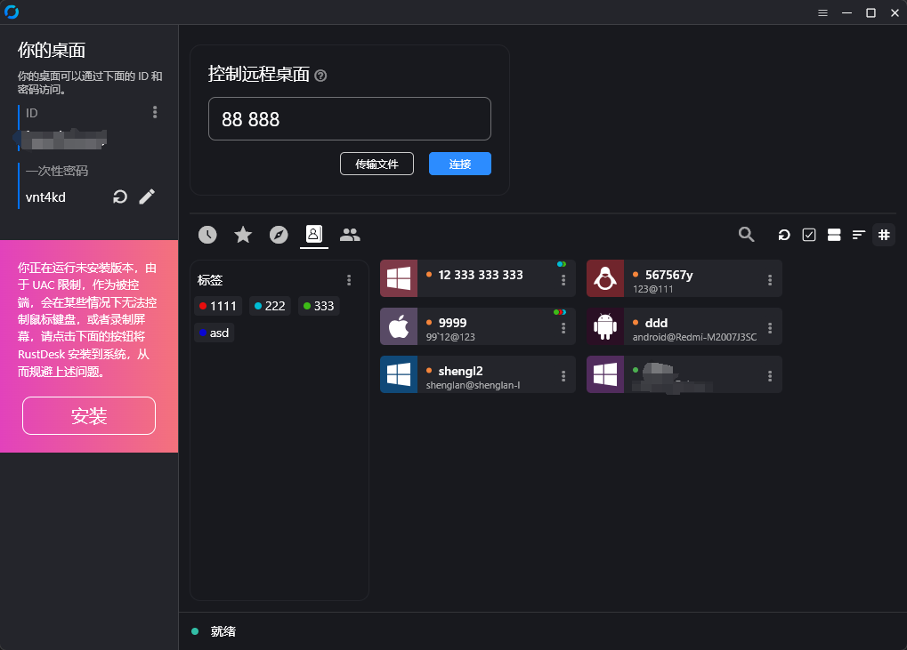
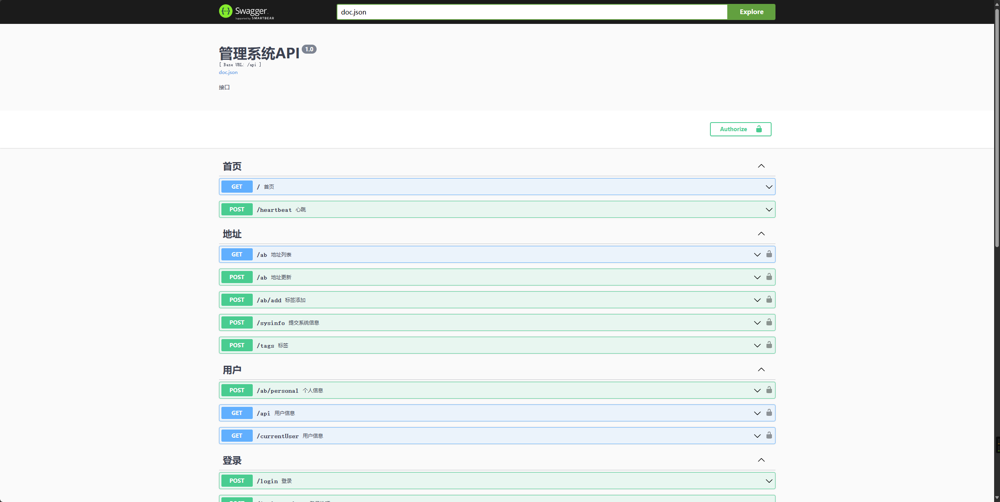

# RustDesk API

本项目使用 Go 实现了 RustDesk 的 API，并包含了 Web UI 和 Web 客户端。RustDesk 是一个远程桌面软件，提供了自托管的解决方案。

## 使用前准备

### Rustdesk

1. PC客户端使用的是 ***1.3.0***，经测试 ***1.2.6+*** 都可以
2. server端必须指定key，不能用自带的生成的key,否则可能链接不上或者超时

```bash
hbbs -r <relay-server-ip[:port]> -k 123456789
hbbr -k 123456789
```

## 功能

### **API 服务**: 基本实现了PC端基础的接口。




### **Web UI**: 使用前后端分离，提供用户友好的管理界面，主要用来管理和展示。

***初次安装管理员为用户名密码为admin admin，请即时更改密码***

1. 管理员界面
   
2. 普通用户界面
   
3. 更改密码在右上角


4. 分组可以自定义，方便管理，暂时支持两种类型: `共享组` 和 `普通组`
   

### **Web 客户端**:

1. 如果已经登录了后台，web client将自动直接登录
2. 如果没登录后台，点击右上角登录即可，api server已经自动配置好了
3. 登录后台后，会将地址簿自动保存到web client中，方便使用
   

### **自动化文档**: 使用 Swag 生成 API 文档，方便开发者理解和使用 API。

1. 后台文档 <youer server>/admin/swagger/index.html
2. PC端文档 <youer server>/swagger/index.html
   

## 安装与运行

### 相关配置

* 参考`conf/config.yaml`配置文件，修改相关配置。如果`gorm.type`是`sqlite`，则不需要配置mysql相关配置。

```yaml
gin:
  api-addr: "0.0.0.0:21114"
  mode: "release"
  resources-path: 'resources'
gorm:
  type: "sqlite"
  max-idle-conns: 10
  max-open-conns: 100
mysql:
  username: "root"
  password: "111111"
  addr: "192.168.1.66:3308"
  dbname: "rustdesk"
rustdesk:
  id-server: "192.168.1.66:21116"
  relay-server: "192.168.1.66:21117"
  api-server: "http://192.168.1.66:21114"
  key: "123456789"
```

### 安装步骤

#### docker运行

#### 下载release直接运行

#### 源码安装

1. 克隆仓库
   ```bash
   git clone https://github.com/lejianwen/rustdesk-api.git
   cd rustdesk-api
   ```
2. 安装依赖
    ```bash
    go mod tidy
    #安装swag，如果不需要生成文档，可以不安装
    go install github.com/swaggo/swag/cmd/swag@latest
    ```
3. 运行
    ```bash
    go run cmd/apimain.go
    #或者直接Build
    ./build.sh
    #或者使用generate_api.go生成api
    go generate generate_api.go
    ```
4. 编译，如果想自己编译,先cd到项目根目录，然后windows下直接运行`build.bat`,linux下运行`build.sh`,编译后会在`release`
   目录下生成对应的可执行文件。
